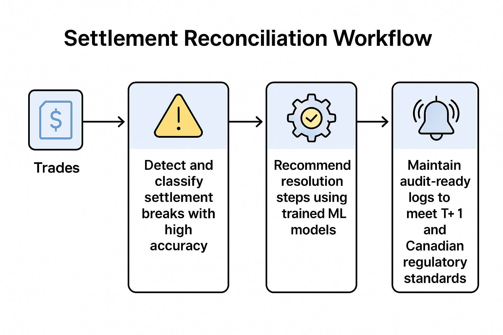

# AI Powered Bond Post-Trade Break Detection & Resolution

**Model zoo**

| Asset                     | Hugging Face link                                                                                                                |
| ------------------------- | -------------------------------------------------------------------------------------------------------------------------------- |
| DistilBERT-Reconciler     | [https://huggingface.co/kelvi23/DistilBERT-Reconciler](https://huggingface.co/kelvi23/DistilBERT-Reconciler)         |
| **BERT baseline**         | [https://huggingface.co/Coreledger/bert-breaks-v0](https://huggingface.co/Coreledger/bert-breaks-v0)                             |
| Next-day fails forecaster | [https://huggingface.co/kelvi23/Streaming-fail-forecaster](https://huggingface.co/kelvi23/Streaming-fail-forecaster)             |
| Settlement-stress flagger | [https://huggingface.co/kelvi23/settlement-stress-flagger-v1](https://huggingface.co/kelvi23/settlement-stress-flagger-v1) |

Executive Summary 
Financial institutions face significant challenges in post-trade reconciliation, matching internal trade records with external data, due to high volumes, complex data formats, and strict regulatory deadlines. Manual exception handling is error-prone and time-consuming, leading to inconsistencies that can result in financial misstatements or regulatory penalties [highradius.com](https://www.highradius.com/resources/Blog/trade-reconciliation/#:~:text=Trade%20reconciliation%20plays%20a%20vital,a%20loss%20of%20investors%20confidence). This project addresses these challenges by automating trade break detection and reconciliation in fixed-income workflows.

To ensure the safe and compliant use of sensitive internal and external reconciliation data, we will leverage our internal privacy solution, PrivacyGuard. PrivacyGuard automatically identifies and anonymizes personally identifiable information (PII), laying a robust foundation for secure data sharing and future public data initiatives. This proactive approach strengthens our compliance posture while facilitating seamless integration and collaboration.

We leverage machine learning (ML) and advanced data pipelines to detect discrepancies (“breaks”), classify their root causes, and recommend resolutions, all while maintaining a tamper-proof audit trail for compliance. A domain-adapted DistilBERT model has been fine-tuned on millions of historical break-resolution pairs, achieving high accuracy (≈88% micro-F1) in classifying exception root causes and suggesting fixes. Additionally, we developed a fuzzy matching micro-service using RapidFuzz to link external tickets to internal trade IDs with over 96% accuracy and created a prototype dashboard for real-time break triage and monitoring.

Key results to date include significant improvements in efficiency and accuracy. Early demo estimates indicate a potential ≥ 60% reduction in manual reconciliation effort, substantially lowering settlement failure rates and associated penalty fees. The solution provides real-time alerts for trade breaks, enabling faster intervention to prevent failed settlements. Importantly, the system’s design aligns with regulatory requirements, logging all reconciliation actions and ML-driven decisions with **hash-chained, tamper-evident** records to satisfy T+1 audit trail obligations (Regulators now expect robust record-keeping to validate compliance with the new T+1 settlement rules [capco.com](https://www.capco.com/intelligence/capco-intelligence/t-1-post-go-live-institutions-must-stay-on-their-toes#:~:text=In%20addition%2C%20on%20August%206%2C,newly%20established%20SEC%20regulatory%20rules). This modular architecture, built with micro-services and open APIs, also facilitates easy integration with existing systems and positions us to extend the solution to other asset classes such as equities, repos, and crypto, with minimal retraining. 

In summary, the project has delivered a robust suite of AI-powered reconciliation tools and prototypes demonstrating clear and tangible value. The next phase focuses on production readiness by scaling the real-time pipeline, enhancing the UI, refining XML parsing, and rigorously documenting model risks for compliance.

This white paper outlines our comprehensive initiative to automate exception handling and reconciliation in fixed-income trading workflows, leveraging advanced machine learning techniques and sophisticated data processing capabilities to address industry-wide challenges effectively

## Citation
Musodza, K. (2025). Bond Settlement Automated Exception Handling and Reconciliation. Zenodo. https://doi.org/10.5281/zenodo.16828730

Coreledger Technologies Inc (2025)

